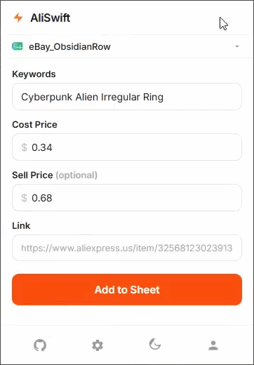
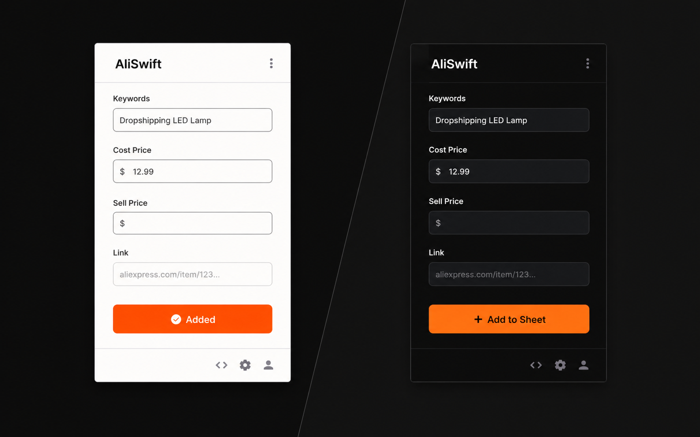
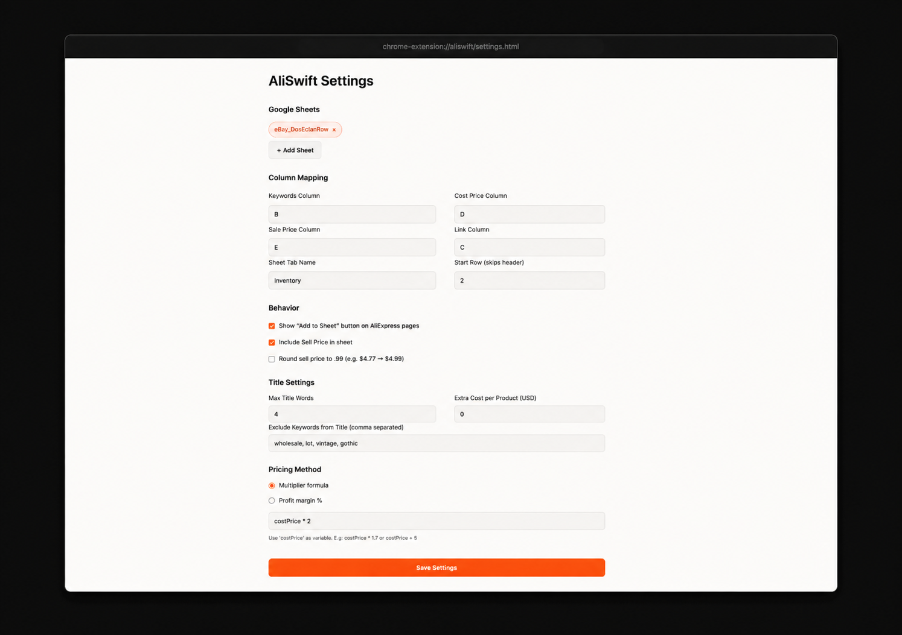
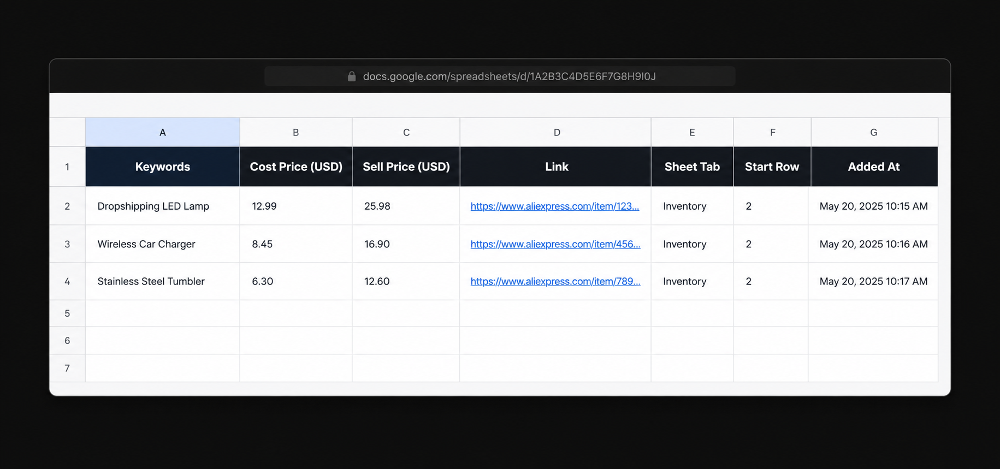

<div align="center">


[](https://github.com/envyxyz/aliswift/releases)
[](LICENSE)
[](https://github.com/envyxyz/aliswift/releases)
[](https://developers.google.com/sheets)
[](https://github.com/envyxyz/aliswift/stargazers)

**1-click AliExpress product scraper. Title, cost, sell price, and supplier link | straight into your Google Sheet.**



</div>

---

## Overview

AliSwift is a Chrome extension built for eBay and Shopify dropshippers who source from AliExpress. Instead of copying product titles, prices, and links by hand, you click one button and the data lands exactly where you need it in Google Sheets -- formatted, priced, and ready.

It supports multiple sheet presets with independent settings, formula and margin-based pricing, sell price rounding, keyword filtering, and automatic shipping cost detection. Built with vanilla JS and Chrome MV3. No subscriptions, no external services, no nonsense.
<br/>

## Features

- **1-click scraping** -- title, cost price, sell price, and supplier link in one shot
- **On-page button** -- injected directly into the AliExpress product page
- **Multi-sheet presets** -- switch between sheets, each with its own column mapping, tab name, and pricing settings
- **Formula and margin pricing** -- use a multiplier formula like `costPrice * 2.7` or a profit margin percentage
- **Sell price rounding** -- round to `.99` automatically (e.g. $4.77 becomes $4.99)
- **Title controls** -- set max word count and filter out noise words like "wholesale", "lot", "pieces"
- **Extra cost per product** -- add a fixed amount to every cost price before the formula runs
- **Dark and light mode** -- popup follows your system theme

## Screenshots

<!-- REPLACE WITH: popup.png -- the popup UI with fields filled in (dark mode preferred) -->
<!-- Dimensions: show the full popup, crop tight, 400px wide -->

**Popup**


<!-- REPLACE WITH: settings.png -- the options page showing two sheet nuggets and all settings filled -->
<!-- Dimensions: full options page screenshot, 800px wide -->

**Settings**


<!-- REPLACE WITH: sheet.png -- Google Sheets with a freshly appended row highlighted -->
<!-- Dimensions: crop to show columns A-E and a few rows, 1000px wide -->

**Result in Google Sheets**


## Installation

AliSwift is not on the Chrome Web Store yet. Install it manually in under a minute.

**1. Download the latest release**

Go to [Releases](https://github.com/envyxyz/aliswift/releases) and download the latest release.

**2. Extract the zip**

Unzip the file. You will get a folder named `aliswift`.

**3. Load into Chrome**

```
chrome://extensions
```

- Enable **Developer Mode** using the toggle in the top right corner
- Click **Load unpacked**
- Select the extracted `aliswift` folder

**4. Pin the extension**

Click the puzzle icon in your Chrome toolbar and pin AliSwift for quick access.

## Setup

### Google Sheet

1. Create a new Google Sheet (must be a native Google Sheet, not an uploaded `.xlsx` file)
2. Set up your column headers however you like
3. Copy the Sheet ID from the URL -- it is the long string between `/d/` and `/edit`

```
https://docs.google.com/spreadsheets/d/[THIS-IS-YOUR-SHEET-ID]/edit
```

### Extension Settings

1. Click the AliSwift icon and open **Settings** (gear icon)
2. Click **+ Add Sheet**, enter your sheet name, Sheet ID, and the tab name (e.g. `Inventory`)
3. Set your column mapping to match your sheet headers
4. Choose your pricing method and configure title settings
5. Click **Save Settings**

## Usage

1. Open any AliExpress product page
2. Click the green **Add to Sheet** button injected below the Buy Now button, or use the popup
3. The product data is scraped, priced, and written to your active sheet instantly

To switch sheets, open Settings and click a different sheet preset. All settings update automatically.

## Known Issues

- **Shipping detection is limited** -- AliSwift can only detect shipping costs that are explicitly displayed on the product page. If AliExpress shows "Free shipping above $X" or hides the cost until checkout, no shipping cost is added. Use the **Extra Cost** setting as a manual fallback.
- **Native Google Sheets only** -- the Sheets API does not support `.xlsx` files uploaded to Drive. Convert your file via File > Save as Google Sheets before use.
- **Chrome profile required for auth** -- the OAuth flow uses `chrome.identity` which requires you to be signed into a Google account in your Chrome profile. This is a Chrome extension platform limitation.
- **AliExpress layout changes** -- AliExpress occasionally updates their page structure. If the price or title stops scraping correctly, open an issue and it will be patched.

## Planned

- Chrome Web Store release
- Bulk scrape from AliExpress search/category pages
- Image URL scraping
- Firefox support

## System Architecture

AliSwift is built as a Chrome Extension (Manifest V3) designed to bridge the gap between dynamic e-commerce web interfaces and structured data storage. The system follows a decoupled architecture, separating the UI-driven scraping logic from the background orchestration of API requests.

### Data Flow Overview

```mermaid
graph LR
    A[AliExpress Page] -->|Content Script Scrapes| B(AliSwift Extension)
    B -->|OAuth 2.0 Token| C{Google Sheets API}
    B -->|POST/PUT Request| D[Google Sheets]

    style B fill:#FF9500,stroke:#333,stroke-width:2px,color:#fff
    style C fill:#fff,stroke:#333,stroke-dasharray: 5 5

## Versions

| Version | Notes                                                                                   |
| ------- | --------------------------------------------------------------------------------------- |
| `0.5.0` | Per-sheet behavior settings, title controls, .99 rounding, extra cost, shipping scraper |
| `0.4.0` | Title length, keyword filter, sale price toggle, extra cost field                       |
| `0.3.0` | Per-sheet column mapping, batchUpdate writes, smart row detection                       |
| `0.2.0` | Multi-sheet presets, formula pricing, on-page button, spinner feedback                  |
| `0.1.0` | Initial release                                                                         |

## Author

Built by [ameer<3](https://github.com/envyxyz)

[](https://github.com/envyxyz)

## License

MIT License. See [LICENSE](LICENSE) for details.

---

<div align="center">

If AliSwift saves you time, consider leaving a star.

[](https://github.com/envyxyz/aliswift/stargazers)

</div>
```
